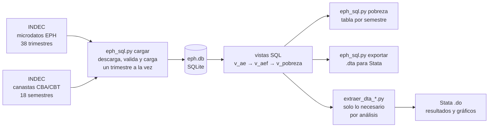

# Pobreza-Argentina: pipeline automatizado de la EPH (INDEC)


**Un solo script descarga los microdatos de la Encuesta Permanente de Hogares (EPH) de todos los trimestres, descarga las canastas de pobreza e indigencia del INDEC, y deja todo unido en una base SQLite lista para analizar.** Sin descargar, descomprimir, filtrar ni pegar archivos a mano.

El resultado es un dataset de **~2 millones de filas** (personas-trimestre, 2016-T3 a 2025-T4) con los ingresos, los adultos equivalentes y los indicadores de pobreza ya calculados. Sobre esa base construí dos análisis (descomposición de la pobreza y pobreza en estudiantes universitarios), que están al final como ejemplos de lo que se puede hacer una vez que los datos están listos.


---

## Automatización: un comando en lugar de horas de trabajo manual

Armar una serie larga de la EPH a mano implica, para cada uno de los 38 trimestres: encontrar el archivo en el sitio del INDEC (cuyos nombres y formatos cambiaron varias veces), descargarlo, descomprimirlo, abrir la base individual, quedarse con las variables útiles, y pegarlo con los demás. Después hay que hacer lo mismo con los 18 archivos de canastas (uno por semestre, con otro formato y otra estructura) y cruzarlos por región y período.

Este repo lo resuelve con un script:

```bash
pip install -r requirements.txt
cd "Base de datos"
python eph_sql.py cargar      # descarga microdatos + canastas y arma eph.db
python eph_sql.py pobreza     # imprime pobreza e indigencia por semestre
python eph_sql.py exportar    # (opcional) genera un .dta para Stata
```

Qué hace `cargar` sin intervención:

- Descarga los **38 trimestres** de microdatos (2016-T3 a 2025-T4) y los **18 archivos de canastas** (2017 a 2025).
- Ubica la base individual dentro de cada zip, incluso cuando está **anidada en otro zip**, y lee `.txt`, `.xls` o `.xlsx` según el trimestre.
- Se adapta a los cambios de nombres del INDEC probando las variantes conocidas (`1er`/`1`, con y sin guion bajo, distintos formatos). Las excepciones quedan en tablas de alias versionadas en git.
- Detecta cuando el sitio devuelve una página HTML en lugar de un archivo (verificando el tipo real del archivo) y prueba la siguiente variante.
- Es **incremental e idempotente**: si se vuelve a correr, solo baja los trimestres que faltan.
- **Valida lo que carga**: contrasta las canastas parseadas contra valores de control conocidos y, si algo falla, termina con código de error y un resumen. No falla en silencio.
- Deja el período **fijo** (`PRIMER_TRIM` / `ULTIMO_TRIM`), así que dos corridas en distintas máquinas dan la misma base.

## Velocidad y eficiencia

La alternativa obvia sería automatizar la descarga y cargar todo en `pandas`. Funciona, pero hay que mantener ~2 millones de filas con todas sus columnas en memoria, y es bastante más lento. La base se diseñó para correr en una PC con poca RAM.

| Enfoque | Esfuerzo | Memoria | Tiempo |
|---|---|---|---|
| Manual (descargar, descomprimir, filtrar y unir a mano) | Alto, repetitivo y propenso a errores | Un trimestre a la vez, en el programa que se use | **Horas** |
| Automatizado en Python, todo en memoria (`pandas.concat`) | Bajo | ~2 millones de filas simultáneas | **Más de 10 veces** lo que tarda la versión SQLite |
| **Este repo (Python + SQLite)** | **Un comando** | **Un trimestre a la vez** | **Referencia** |


## Cómo funciona




## El dataset resultante

| Objeto | Contenido |
|---|---|
| `individuos` | Una fila por persona y trimestre (18 variables de la EPH: identificadores, ingresos `itf` e `ipcf`, ponderadores `pondera` y `pondih`, región, aglomerado, edad, sexo, parentesco, asistencia, tipo de gestión y nivel educativo, condición de actividad) |
| `canastas` | Líneas de indigencia y pobreza por región y trimestre (promedio de los 3 meses) |
| `cargados` | Control de qué trimestres están cargados, con cantidad de filas y fecha |
| `v_ae` / `v_aef` | Adultos equivalentes por persona y por hogar (tabla de equivalencias del INDEC) |
| `v_pobreza` | Ingreso por adulto equivalente, línea de pobreza e indigencia aplicable, y clasificación pobre / indigente |

Con `python eph_sql.py exportar` se genera además `bases_eph_2016-2025.dta` (opcionalmente desde otro año: `exportar 2023`).

La base no se incluye en el repo (está en `.gitignore`) porque se regenera con un comando a partir de fuentes públicas.

## Usos del dataset

Con los datos ya limpios y unidos, el trabajo de análisis es corto. Dejo dos ejemplos de indicadores de pobreza construidos sobre la misma base. Ambos se hacen en Stata a partir de extractos chicos que genera Python.

### 1. Descomposición del cambio en la pobreza

Descompone la variación de la tasa de pobreza entre segundos semestres en un **efecto ingreso** (cambia la media real) y un **efecto distribución** (cambia la forma de la distribución), con el método de Shapley (Datt-Ravallion) y los índices FGT(0), FGT(1) y FGT(2). El ingreso se deflacta con el índice implícito de las propias líneas de pobreza.

<p align="center">
  
</p>

Además del corte anual, el código compara períodos por gobierno y arma una serie de tiempo con escenarios contrafactuales (`graficos/serie_tiempo_pobreza.png`).

Código: [`Descomposicion de la pobreza/`](Descomposicion%20de%20la%20pobreza/)

### 2. Pobreza en estudiantes universitarios

Mide pobreza, indigencia y empleo en estudiantes universitarios (gestión pública vs privada) y su distribución por decil y quintil de ingreso per cápita familiar. Los deciles se calculan sobre toda la población de cada trimestre, con ponderadores.

<p align="center">
  
</p>

Código: [`Pobreza universitaria/`](Pobreza%20universitaria/)

## Cómo reproducirlo

**Requisitos**

- Python 3.8 o superior y las librerías de `requirements.txt` (`pandas`, `numpy`, `openpyxl`, `xlrd`).
- Conexión a internet en la primera corrida. Una vez cargada, la base se consulta sin conexión.
- Stata 14 o superior, solo para los dos análisis de la sección anterior. La base y los `.dta` se pueden usar desde cualquier otra herramienta.

**Pasos**

1. Clonar e instalar dependencias:
   ```bash
   git clone https://github.com/Marco-D-Sosa/Pobreza-Argentina.git
   cd Pobreza-Argentina
   pip install -r requirements.txt
   ```
2. Construir la base (la primera vez baja todo; las siguientes solo lo que falta):
   ```bash
   cd "Base de datos"
   python eph_sql.py cargar
   ```
3. Generar el extracto y correr el análisis que interese:
   ```bash
   cd "../Descomposicion de la pobreza"     # o "../Pobreza universitaria"
   python extraer_dta_descomp.py            # o extraer_dta_uni.py
   ```
   Luego abrir el `.do` correspondiente en Stata, completar `local proy` con la ruta de esa carpeta y ejecutarlo. Los resultados quedan en un Excel y en `graficos/`.

**Configuración** (al principio de `eph_sql.py`)

| Variable | Qué controla |
|---|---|
| `PRIMER_TRIM` / `ULTIMO_TRIM` | Período analizado |
| `BORRAR_ZIP` | `False` conserva los zips de microdatos descargados, para poder recargarlos sin volver a bajarlos |
| `EPH_ALIAS` / `CANASTA_ALIAS` | Nombres de archivo del INDEC que no siguen el patrón habitual |
| `CONTROL` | Valores de referencia para validar el parseo de canastas |

## Estructura del repositorio

```
Pobreza-Argentina/
├── Base de datos/
│   ├── eph_sql.py                    # descarga, carga, validación y vistas (el script principal)
│   └── EPH diseño.pdf                # diseño de registro de la EPH (INDEC)
├── Descomposicion de la pobreza/
│   ├── extraer_dta_descomp.py        # extracto desde eph.db
│   ├── descomposicion_pobreza.do     # descomposición Shapley y serie de tiempo
│   └── graficos/
├── Pobreza universitaria/
│   ├── extraer_dta_uni.py            # extracto y deciles ponderados
│   ├── pobreza_universitaria.do      # pobreza, empleo y distribución por decil/quintil
│   └── graficos/
├── requirements.txt
└── LICENSE
```

## Notas metodológicas y limitaciones

- **Son estimaciones propias con la metodología del INDEC**, no las cifras de sus informes. Pueden diferir levemente: la línea de cada trimestre es el promedio de los tres meses, y los semestres se arman juntando dos trimestres con el ponderador `pondih`.
- **La serie de pobreza arranca en 2017.** Los microdatos se cargan desde 2016-T3, pero las canastas disponibles empiezan en 2017.
- **La EPH tiene cobertura urbana** (aglomerados urbanos) y es una encuesta por muestreo: los resultados tienen error muestral.
- **En estudiantes universitarios las muestras por semestre son chicas**, en especial en universidades privadas, y no se calculan intervalos de confianza. Conviene leer las tendencias y no cada punto.
- **Estudiante universitario** = asiste actualmente (`ch10 = 1`) a nivel universitario (`ch12 = 7`).
- Los `.do` tienen fijado el último período (`2025-2`) para los gráficos de un solo semestre y las comparaciones por gobierno; hay que actualizarlo al extender la serie.

## Fuentes y licencia

- Microdatos: [Encuesta Permanente de Hogares](https://www.indec.gob.ar/Institucional/Indec/BasesDeDatos), INDEC. Canastas básicas y líneas de pobreza: informes de pobreza del INDEC. Los datos pertenecen al INDEC (fuente: INDEC, www.indec.gob.ar) y se descargan directamente de su sitio; este repo no los redistribuye.
- Código bajo licencia [MIT](LICENSE).

**Autor:** Marco D. Sosa · [github.com/Marco-D-Sosa](https://github.com/Marco-D-Sosa)
