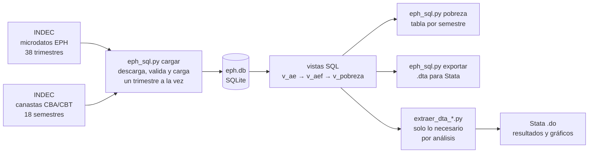

# Pipeline ETL y Automatización de datos: de horas de trabajo manual a un solo comando

**Automatización de la descarga, verificación y unión de los datos de la Encuesta Permanente de Hogares (EPH, INDEC), para analizar ingresos y pobreza de forma rápida y sencilla.**


---

## Resumen

**El problema.** Los datos de la EPH se publican en decenas de archivos separados, con formatos y nombres que cambian de un período a otro. Prepararlos para analizarlos lleva horas de trabajo manual y es fácil cometer errores.

**La solución.** Un proceso automático que descarga todos los archivos, los verifica, los une y calcula los indicadores de pobreza. Deja una base de datos única, lista para consultar, con **~2 millones de registros** (2016 a 2025).

**El resultado.** Lo que antes eran horas de descargar, ordenar y copiar archivos se resuelve con **un solo comando**. Además, es **más de 10 veces más rápido** que la alternativa habitual en Python y funciona en una computadora común.

> ¿Buscás el detalle técnico? Está en la sección final: [Detalle técnico](#detalle-técnico).

## Qué valor aporta

| | Proceso manual | Este proyecto |
|---|---|---|
| **Tiempo** | Horas de trabajo repetitivo | Un solo comando |
| **Errores** | Riesgo de equivocarse al copiar, filtrar y pegar | Verificaciones automáticas; avisa si algo falla |
| **Actualización** | Rehacer todo cada vez | Solo incorpora lo que falta |
| **Recursos** | Computadoras potentes o mucha espera | Funciona en una PC común |
| **Resultado** | Depende de quién lo haga | Siempre el mismo, con cualquier usuario |

- **Ahorra tiempo de tareas repetitivas.** 38 trimestres de microdatos y 18 informes de canastas se descargan y se unen solos.
- **Reduce errores.** El proceso controla lo que carga y se detiene con un aviso claro si algo no cuadra.
- **Se mantiene al día.** Incorporar un período nuevo no implica volver a empezar.
- **Cuida los recursos.** Procesa los datos por partes en lugar de cargar todo junto, por eso es más rápido y liviano.
- **Es reproducible y está documentado.** Cualquier persona del equipo puede obtener los mismos resultados.

**Aplicable más allá de este caso:** la misma lógica sirve para cualquier proceso que consolide archivos periódicos de fuentes externas (reportes, bases de clientes o proveedores, datos públicos) y quiera dejar de hacerlo a mano.

## Qué se puede hacer con los datos listos

Cuando la preparación de datos está resuelta, analizar es mucho más simple. Como demostración, usé la misma base para responder dos preguntas distintas, sin repetir el trabajo previo.

### Ejemplo 1: ¿Por qué cambió la pobreza?

Separa el cambio de un año a otro en dos causas: que **cambió el nivel de ingresos** de los hogares, o que **cambió cómo se reparten** esos ingresos. También incluye comparaciones entre períodos y escenarios hipotéticos ("qué hubiera pasado si...").


<p align="center">
  
</p>

*Cada grupo de barras es el cambio entre dos años, en puntos porcentuales: en azul, lo explicado por los ingresos; en rojo, por la distribución; en verde, el total.*

Código: [`Descomposicion de la pobreza/`](Descomposicion%20de%20la%20pobreza/)

### Ejemplo 2: Pobreza en estudiantes universitarios

Compara qué proporción de estudiantes universitarios vive en hogares pobres según estudien en universidad **pública o privada**, cómo trabajan y cómo se distribuyen por nivel de ingresos.

<p align="center">
  
</p>

*Porcentaje de estudiantes en hogares pobres, por semestre. Son estimaciones a partir de una encuesta por muestreo (ver [notas](#notas-metodológicas-y-limitaciones)).*

Código: [`Pobreza universitaria/`](Pobreza%20universitaria/)


## Detalle técnico

### Cómo funciona



Qué hace `python eph_sql.py cargar` sin intervención:

- Descarga los **38 trimestres** de microdatos (2016-T3 a 2025-T4) y los **18 archivos de canastas** (2017 a 2025).
- Ubica la base individual dentro de cada zip, incluso cuando está **anidada en otro zip**, y lee `.txt`, `.xls` o `.xlsx` según el trimestre.
- Se adapta a los cambios de nombres del INDEC probando las variantes conocidas (`1er`/`1`, con y sin guion bajo, distintos formatos). Las excepciones quedan en tablas de alias versionadas en git.
- Detecta cuando el sitio devuelve una página HTML en lugar de un archivo (verificando el tipo real del archivo) y prueba la siguiente variante.
- Es **incremental e idempotente**: si se vuelve a correr, solo baja los trimestres que faltan.
- **Valida lo que carga**: contrasta las canastas parseadas contra valores de control conocidos y, si algo falla, termina con código de error y un resumen. No falla en silencio.
- Deja el período **fijo** (`PRIMER_TRIM` / `ULTIMO_TRIM`), así que dos corridas en distintas máquinas dan la misma base.

**Por qué es más eficiente que cargar todo en `pandas`:** procesa un trimestre a la vez (la memoria depende de un trimestre, no de los ~2 millones de filas), lee solo las 18 variables necesarias, guarda y consulta en disco con SQLite, y define adultos equivalentes y pobreza como vistas SQL en lugar de copias intermedias.

### El dataset resultante

| Objeto | Contenido |
|---|---|
| `individuos` | Una fila por persona y trimestre (18 variables de la EPH: identificadores, ingresos `itf` e `ipcf`, ponderadores `pondera` y `pondih`, región, aglomerado, edad, sexo, parentesco, asistencia, tipo de gestión y nivel educativo, condición de actividad) |
| `canastas` | Líneas de indigencia y pobreza por región y trimestre (promedio de los 3 meses) |
| `cargados` | Control de qué trimestres están cargados, con cantidad de filas y fecha |
| `v_ae` / `v_aef` | Adultos equivalentes por persona y por hogar (tabla de equivalencias del INDEC) |
| `v_pobreza` | Ingreso por adulto equivalente, línea de pobreza e indigencia aplicable, y clasificación pobre / indigente |

Con `python eph_sql.py exportar` se genera además `bases_eph_2016-2025.dta` (opcionalmente desde otro año: `exportar 2023`).

La base no se incluye en el repo (está en `.gitignore`) porque se regenera con un comando a partir de fuentes públicas.

### Cómo reproducirlo

**Requisitos**

- Python 3.8 o superior y las librerías de `requirements.txt` (`pandas`, `numpy`, `openpyxl`, `xlrd`).
- Conexión a internet en la primera corrida. Una vez cargada, la base se consulta sin conexión.
- Stata 14 o superior, solo para los dos análisis de ejemplo. La base y los `.dta` se pueden usar desde cualquier otra herramienta.

**Pasos**

1. Clonar e instalar dependencias:
   ```bash
   git clone https://github.com/Marco-D-Sosa/Pobreza-Argentina.git
   cd Pobreza-Argentina
   pip install -r requirements.txt
   ```
2. Construir la base (la primera vez baja todo; las siguientes solo lo que falta):
   ```bash
   cd "Base de datos"
   python eph_sql.py cargar      # descarga microdatos + canastas y arma eph.db
   python eph_sql.py pobreza     # imprime pobreza e indigencia por semestre
   python eph_sql.py exportar    # (opcional) genera un .dta para Stata
   ```
3. Generar el extracto y correr el análisis que interese:
   ```bash
   cd "../Descomposicion de la pobreza"     # o "../Pobreza universitaria"
   python extraer_dta_descomp.py            # o extraer_dta_uni.py
   ```
   Luego abrir el `.do` correspondiente en Stata, completar `local proy` con la ruta de esa carpeta y ejecutarlo. Los resultados quedan en un Excel y en `graficos/`.

**Configuración** (al principio de `eph_sql.py`)

| Variable | Qué controla |
|---|---|
| `PRIMER_TRIM` / `ULTIMO_TRIM` | Período analizado |
| `BORRAR_ZIP` | `False` conserva los zips de microdatos descargados, para poder recargarlos sin volver a bajarlos |
| `EPH_ALIAS` / `CANASTA_ALIAS` | Nombres de archivo del INDEC que no siguen el patrón habitual |
| `CONTROL` | Valores de referencia para validar el parseo de canastas |

### Estructura del repositorio

```
Pobreza-Argentina/
├── Base de datos/
│   ├── eph_sql.py                    # descarga, carga, validación y vistas (el script principal)
│   └── EPH diseño.pdf                # diseño de registro de la EPH (INDEC)
├── Descomposicion de la pobreza/
│   ├── extraer_dta_descomp.py        # extracto desde eph.db
│   ├── descomposicion_pobreza.do     # descomposición Shapley y serie de tiempo
│   └── graficos/
├── Pobreza universitaria/
│   ├── extraer_dta_uni.py            # extracto y deciles ponderados
│   ├── pobreza_universitaria.do      # pobreza, empleo y distribución por decil/quintil
│   └── graficos/
├── requirements.txt
└── LICENSE
```

### Notas metodológicas y limitaciones

- **Son estimaciones propias con la metodología del INDEC**, no las cifras de sus informes. Pueden diferir levemente: la línea de cada trimestre es el promedio de los tres meses, y los semestres se arman juntando dos trimestres con el ponderador `pondih`.
- **La serie de pobreza arranca en 2017.** Los microdatos se cargan desde 2016-T3, pero las canastas disponibles empiezan en 2017.
- **La EPH tiene cobertura urbana** (aglomerados urbanos) y es una encuesta por muestreo: los resultados tienen error muestral.
- **En estudiantes universitarios las muestras por semestre son chicas**, en especial en universidades privadas, y no se calculan intervalos de confianza. Conviene leer las tendencias y no cada punto.
- **Estudiante universitario** = asiste actualmente (`ch10 = 1`) a nivel universitario (`ch12 = 7`).
- Los `.do` tienen fijado el último período (`2025-2`) para los gráficos de un solo semestre y las comparaciones por gobierno; hay que actualizarlo al extender la serie.


Fuente de los datos: INDEC (Encuesta Permanente de Hogares y canastas de pobreza), www.indec.gob.ar. Código bajo licencia MIT.
